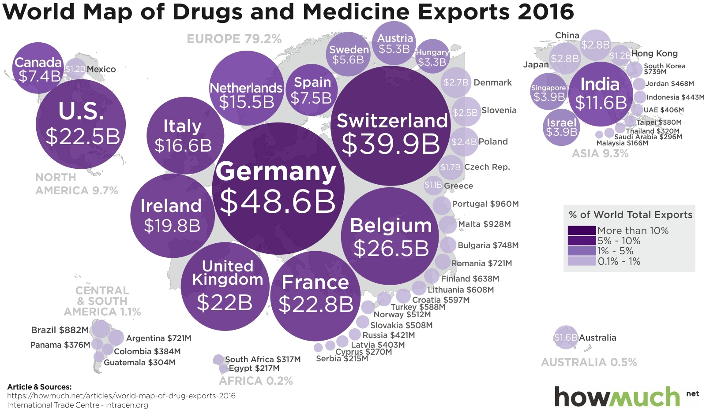
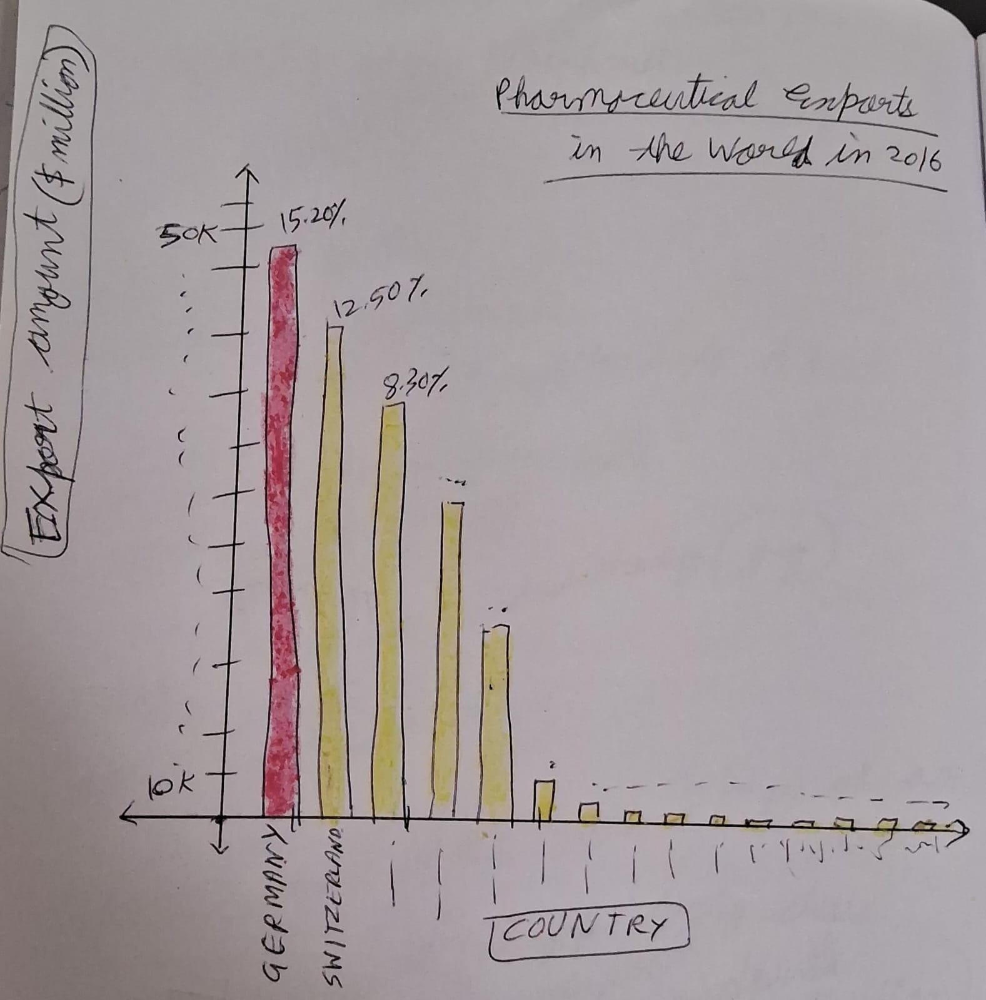

| [home page](https://aishwarya1912s.github.io/portfolio/) | [visualizing debt](https://aishwarya1912s.github.io/portfolio/Visualizing_government_debt_part3.html) | [critique by design](https://aishwarya1912s.github.io/portfolio/critique-by-design.html) | 

# Assignment 3 & 4

      
  
# Where Does Your Medicine Come From? This Map Shows You

[Data Visualization article Link](https://howmuch.net/articles/world-map-of-drug-exports-2016)   

[Data Sources Link](https://howmuch.net/sources/world-map-of-drug-exports-2016) 

Drugs and medicine are big business. In 2016, there was a 1.5% global decline in the total value of drug and medicine exports. Even with that drop, the industry's players exported $318B, making drugs and medicine one of the world's top industries. But where do all those pills, serums, and creams come from?  They wanted to find out. So they dissected the data from 2016 and broke it down by continent, country, and export totals. Then they put it on this map. Check it out.
  
      

# Original Data Visualization

THINGS I DISLIKED:-
What stood out to me immediately were the giant purple blobs in the center of the visualization. They directed all the focus away from the rest of the components and all I could focus on were the dark purple blobs.
Additionally, the color scheme of using varying shades of purple meant that the lightest shades were indistinguishable from each other. The contrast with the text was terribly unclear and a strain to the eyes.
The names of the countries are also all cluttered together and it's very tough to read anything. 
There is no stating of the total number of exports in the world, anywhere in the visualization. 
The bubble sizes all seemed similar and it distorted the perception of relative differences between the bubbles. It can  lead to misinterpretations. 
The font size of the texts here is too small.  
Also, the collective percentage of each continent is almost lost among the bubbles unless the viewer looks for it specifically.
The gray areas on the map for the continent are distracting and unnecessary. It is only making the visualization more cluttered. 
The continent names are also in gray and hence not contrasting well with the white background. 

THINGS I LIKED:-
The title is clear and relevant.
I liked the legend for the percentage of exports. 

MY INITIAL REDESIGN IDEA:-
If i could redesign it, i would not use a bubble chart but instead a bar or line chart, with calm colors and clear text.  It might be better to write it in a different color. 
Also, depending on the use, I would choose to include/exclude some of the countries from the visualization, or at least highlight the relevant ones. In a redesigned bar chart I would use colors like red or green, with blue, yellow to show different categories of export percentage categories. I would also ideally remove the Source and the company logo from the visualization.

WHO I THINK THE PRIMARY AUDIENCE WILL BE? IS IT EFFECTIVE? WHAT CHANGES WOULD YOU MAKE,IF ANY?

I believe the primary audience here are the policymakers, concerned with the economic impact of pharmaceuticals and international trade dynamics. It could also be business professionals working in the pharmaceutical industry who are seeking insights into export trends and potential markets. 

However, the data overload, limited information, and accessibility issues hinder its effectiveness, especially for deeper insights or specific details. Specific comparisons or regional analyses are mainly difficult to do.  Overall, this visualization is not very effective for the audience.

Apart from decluttering it, I would consider introducing zoom, filter, and hover features to allow users to explore specific countries, data points. This would address the issue of limited information and data overload, enabling viewers to delve deeper into areas of interest. Also, I would try to include a more color-blind friendly palette. I would also definitely use more contrasting colors for the bubbles and the text, increase the font size and ensure the total amount of global export money as a statistic  is included in the visualization. Ideally, I would redesign the entire thing into a bar chart.

    

      

# Wireframing

      

      

# Test Interview Feedback

      

First Feedback- student:

What’s your immediate first impression of the picture shown to you?
It looks very yellow! It is sort of distracting to the eyes.

Is it clear what the picture is trying to convey?
I think it is about the percentage of pharmaceutical exports in 2016.

Who do you think the target audience is?
Probably pharma companies.

What did you like most about it?
The clear title. It makes it very easy to understand.

What changes would you suggest to the picture?
Remove the yellow for sure! The red isn’t needed either. Also, after looking closer, I'm a little confused if it is a value in percentage or dollars. Both are visible.

Second Feedback 2- student:

 What’s your immediate first impression of the picture shown to you?
Looks straightforward. Some statistics about exports..

Is it clear what the picture is trying to convey?
Yes, it's about pharmaceutical exports in the world..

Who do you think the target audience is?
Depends, maybe government officers or students doing research.

What did you like most about it?
The clear labels and titles on the bar chart. Also, the descending order bar sizes.

What changes would you suggest to the picture?
Maybe keep all bars the same color. Also, remove the last few bars, they are too small to see or make a difference. Otherwise, it is good.

      

# Redesigned Data Visualization
      
  
  text here...

    

<noscript></noscript><object class='tableauViz'  style='display:none;'><param name='host_url' value='https%3A%2F%2Fpublic.tableau.com%2F' /> <param name='embed_code_version' value='3' /> <param name='site_root' value='' /><param name='name' value='PharmaceuticalExportsintheWorldin2016&#47;Sheet1' /><param name='tabs' value='no' /><param name='toolbar' value='yes' /><param name='static_image' value='https:&#47;&#47;public.tableau.com&#47;static&#47;images&#47;Ph&#47;PharmaceuticalExportsintheWorldin2016&#47;Sheet1&#47;1.png' /> <param name='animate_transition' value='yes' /><param name='display_static_image' value='yes' /><param name='display_spinner' value='yes' /><param name='display_overlay' value='yes' /><param name='display_count' value='yes' /><param name='language' value='en-US' /><param name='filter' value='publish=yes' />
</object>
  

  
      
  

# References

      
  
https://howmuch.net/articles/world-map-of-drug-exports-2016
https://www.trademap.org/Country_SelProduct_TS.aspx?nvpm=1%7c%7c%7c%7c%7cTOTAL%7c%7c%7c2%7c1%7c1%7c2%7c2%7c1%7c2%7c1%7c1%7c1
https://howmuch.net/sources/world-map-of-drug-exports-2016
https://www.worldstopexports.com/drugs-medicine-exports-country/?expand_article=1
