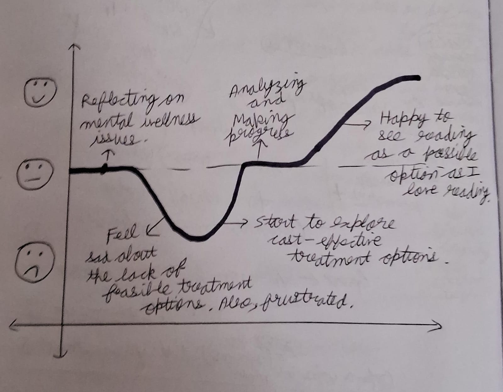
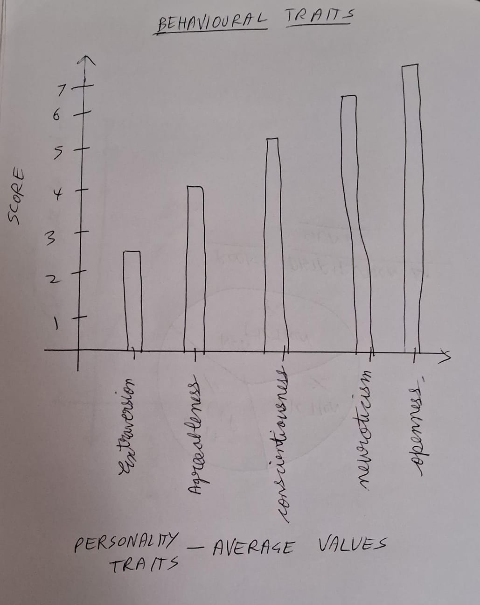
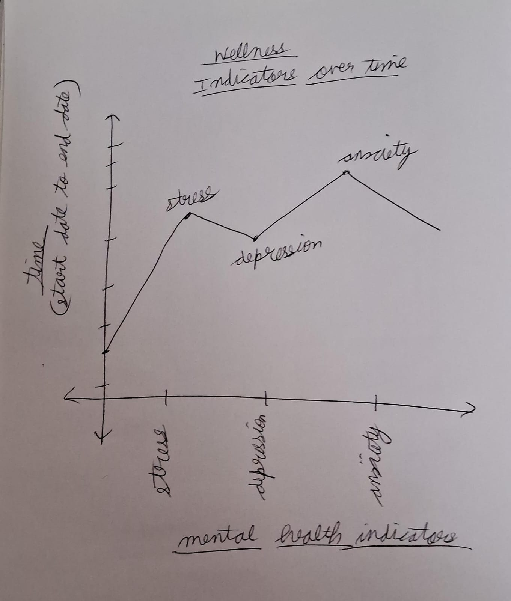
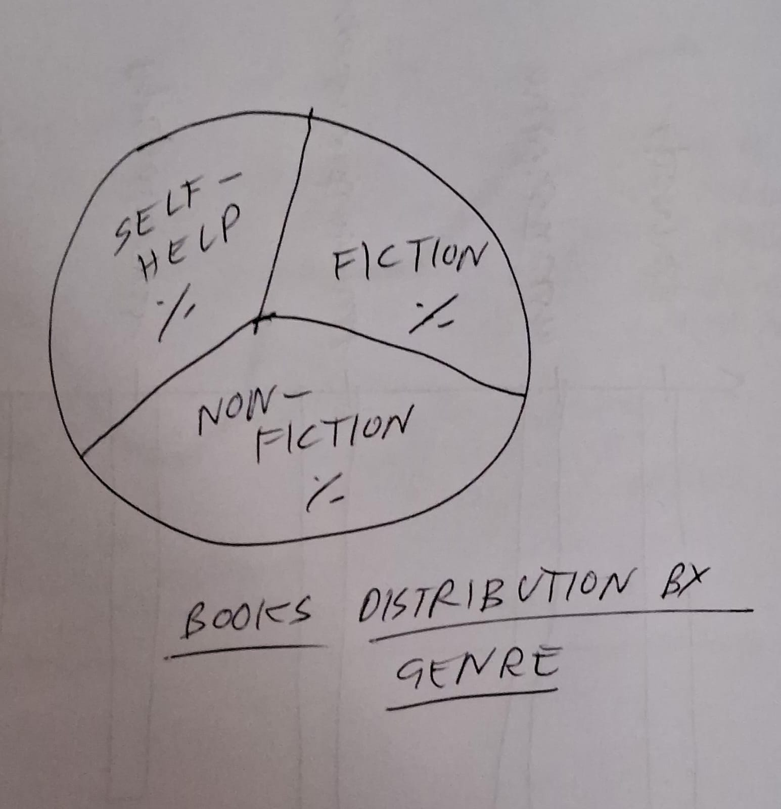

| [home page](https://aishwarya1912s.github.io/portfolio/) | [visualizing debt](https://aishwarya1912s.github.io/portfolio/Visualizing_government_debt_part3.html) | [critique by design](https://aishwarya1912s.github.io/portfolio/critique-by-design.html) | [final project I](https://aishwarya1912s.github.io/portfolio/final-project-part-one.html) | [final project II](https://aishwarya1912s.github.io/portfolio/final-project-part-two.html) | 

# Outline

# Summary
> This project delves into the impact of reading on our wellness, aiming to uncover the potential benefits that literature can have on our health. By analyzing data, I seek to understand how reading habits correlate with mental health indicators and explore the mechanisms through which reading can positively influence emotional and psychological wellness.
My exploration will involve dimensions of the reading experience, including the genres, formats, and frequency of engagement with literature. It will look at how bibliotherapy (a creative arts therapy that involves storytelling or the reading of specific texts) can be useful in addressing our wellness. Drawing a correlation between reading habits and mental health outcomes, I will  highlight the potential of literature as a therapeutic tool for enhancing emotional well-being.

# Project Structure
> In the book Good Charts, (Berinato, 2016, p. 199) it is said that,  “Any story can be told in multiple ways, but a good way to start is to break the idea into three basic dramatic parts: setup, conflict, and resolution.”
Building on those lines, I will structure my project to have the same 3 components:
1. Setup:
Humans suffer from a number of wellness issues, many of them that destroy our mental health. These challenges encompass a broad spectrum of conditions, including stress, anxiety, depression, and other mental health disorders, significantly impacting individuals' overall well-being and quality of life.
2. Conflict:
In the multitude of options available to treat these issues, it is often tough to choose, expensive, and fraught with challenges. From traditional therapies to alternative approaches, navigating the complex landscape of mental health treatment can be overwhelming and financially burdensome. Moreover, the stigma surrounding mental health care further complicates decision-making and access to effective interventions.
3. Resolution: 
In response to the challenges posed by traditional treatment options, I will explore bibliotherapy as a promising alternative for addressing mental health issues. Bibliotherapy harnesses the therapeutic power of literature to promote emotional well-being and resilience, offering a cost-effective and accessible approach to mental health care. Reading is indeed effective in promoting mental health and well-being. Engaging with literature allows individuals to immerse themselves in different worlds, perspectives, and experiences, providing a form of escapism and relaxation that can reduce psychological distress. Analyzing data with visualization will help me draw insights on this.

# User Story

> As an interested student of the topic, I want to explore the connection between reading and mental health so that I can gain a deeper understanding of how literature can contribute to emotional well-being.
I can do this by analyzing empirical data to gain insights on the impact of reading.

      

      

# Initial sketches
> I will create bar charts of research data available to visualize the effectiveness of bibliotherapy as a treatment. This will help me quantify and compare the impact of different literary interventions on mental health outcomes. For example, I can compare the reduction in symptoms like neuroticism among individuals who engaged in reading fiction versus those who participated in traditional therapy sessions, providing concrete evidence of the therapeutic potential of literature.
I will also create line graphs to illustrate the longitudinal effects of bibliotherapy on mental health indicators over time. This will help me track the progression of individuals' well-being before, during, and after engaging in reading interventions.
Pie charts might be helpful to visually represent the distribution of reading preferences among the general population. 
All these tools in combination will give me valuable insights.

      

      

      

      

# The data
> I will obtain the data from open data repositories, mainly from figshare. I have located public data in CSV formats that I can use to filter and preprocess the datasets, ensuring that I extract relevant subsets for my analysis.
These datasets will include data on wellness indicators like stress, depression over time. Also, over personality indicators like neuroticism, agreeableness etc. Visualization of progress scores (progress_t0 or progress_t1) over the duration of the study (duration_t0 or duration_t1) is also possible with the data in the dataset. Additionally, there are well-being scores (wellbeing_CORE_t0) between different demographic groups (e.g., age, sex, marital status).
In another dataset, there are reading instances of unique individuals, enriched with gender and location information.
All these datasets in combination will help give valuable inputs to draw insights.

> Datasets:
1.https://figshare.com/articles/dataset/Five_studies_evaluating_the_impact_on_mental_health_and_mood_of_recalling_reading_and_discussing_fiction/17087135
2.https://figshare.com/articles/dataset/Summary_of_the_benefits_and_effects_of_Life_Story_Book_in_dementia_care_/24251606
3.https://figshare.com/projects/A_Global_Book_Reading_Dataset/118854
4.https://figshare.com/articles/dataset/Mean_results_US_of_the_base_case_cost-effectiveness_model_of_four_parenting_programs_and_bibliotherapy_in_comparison_to_the_waitlist_control_/11304224
5.https://figshare.com/articles/dataset/Readership_characteristics_of_our_experimental_subjects_/20061486

# Method and medium
> With a 3-step well-defined project structure, access to relevant data, and my preliminary sketches in place, I will utilize Tableau and Shorthand to design visually appealing visualizations. These visualizations will not only be clear to read, but they will also provide valuable insights into the benefits of reading for wellness, aiding both my understanding and offering actionable insights for others interested in leveraging literature for mental well-being.

# References
> 1.Berinato, Scott. (2016). Good charts : the HBR guide to making smarter, more persuasive data visualization . Boston: Harvard Business Review.
> 2.https://figshare.com/
> 3.https://www.mdpi.com/2306-5729/6/8/83
